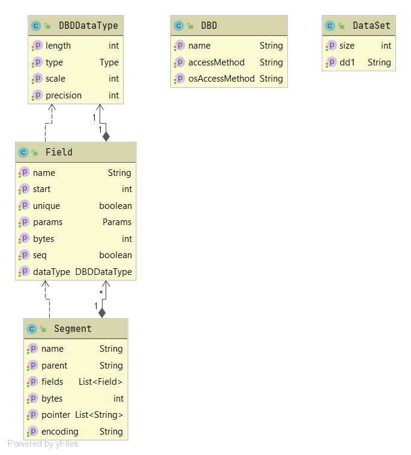
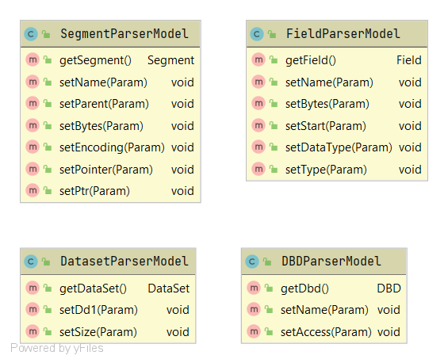
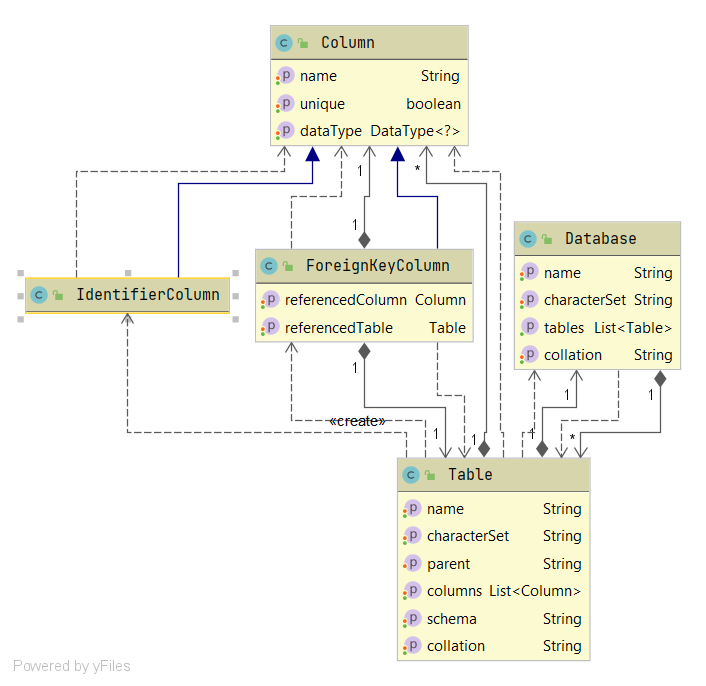
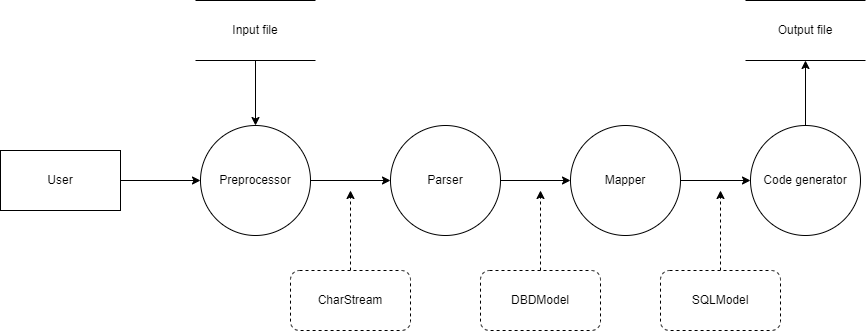
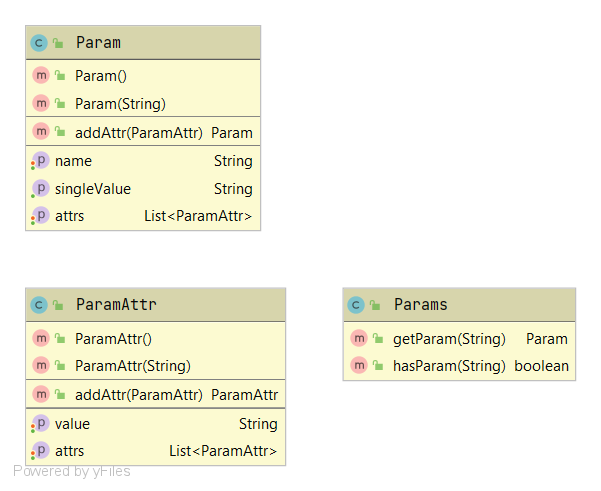

# DBDtoSQL

Technická a Uživatelská dokumentace

Martin Forejt, Přemysl Kouba

## **Základní informace**

DBDtoSQL je konzolová aplikace, která slouží k převodu DBD (database description) souboru, který definuje strukturu hierarchické IBM IMS databáze do SQL souboru, který obsahuje DDL (data definition language) příkazy pro vytvoření relační SQL databáze.

## **Omezení**

Aplikace v současné podobě podporuje pouze jeden typ IMS databáze a to HDAM.

Omezená podpora podporovanyćh struktur DBD. Aplikace podporuje:
* **DBD**
* **DATASET**
* **SEGMENT**
* **FIELD**

Podpora datových typů, které mají ekvivalent v relační DB (vše **kromě** ARRAY a STRUCTURE)

## **Technická dokumentace**
### **Technologie**

- **java 11**
- **maven**
- **ANTLR4**
- **jOOQ**
- **spring-beans**
- **JUnit4**

### **Struktura projektu**

- **resources** – testovací dbd soubory
- **src** – zdrojové kódy aplikace
- **target** – vygenerované zdrojové kódy, spustitelný soubor DBDtoSQL-1.0.jar
- **pom.xml** – maven konfigurace

#### Zdrojové kódy (src):

- **src/main/antlr** – ANTLR4 gramatika (DBDLexer.g4, DBDParser.g4)
- **src/main/java** – vlastní zdrojové kódy konzolové java aplikace
- **src/main/test** – unit testy

### **Gramatika**

Aplikace využívá pro parsování DBD souborů framework **ANTLR4**. Definice gramatiky se nachází v souborech **DBDLexer.g4** a **DBDParser.g4** ze kterých je vygenerovány zdrojové kódy parseru.

Pro generování z gramatiky slouží maven plugin antlr4 a task antlr4, generování spustíme příkazem:

*mvn antlr4:antlr4*

Po doběhnutí jsou vygenerované zdrojové kódy parseru v_ target/generated-sources/antlr4_.

### **Architektura**

Při parsování vstupního DBD souboru se nejprve v preprocesoru odstraní komentáře a další nepotřebné části v DBD souboru a následně se pomocí vygenerovaných antlr visitorů prochází parsovaný strom a vytváří se DBD model viz obrázek 1.

Pro toto parsování je vytvořen ještě pomocný „parser&quot; model viz obrázek 2, kde každá třída obsahuje settry pojmenované stejně jako DBD parametry. Pokud tedy chceme například získat hodnotu DBD parametru _NAME_, vytvoříme v _DBDParserModel_ setter _setName_ s jedním parametrem typu _Param_. Takto jsou pomocí utility spring-beans a reflexe nastaveny hodnoty všech parametrů, které potřebujeme z DBD získat a každý „parser&quot; model dokáže vytvořit „reálný&quot; model. Například tedy z _DBDParserModel_ získáme _DBD_.

Následně je vytvořený DBD model mapován na SQL model (obrázek 3) a to tak, že z DBD segmentů jsou vytvořeny SQL tabulky a z DBD fieldů jsou vytvořeny SQL sloupce (column). Datové typy jsou přemapovány ve třídě DataTypeMapper.

Po vytvoření SQL modelu se pomocí třídy _SqlCodegen_ a nástroje jOOQ vygeneruje SQL kód s DDL příkazy pro vytvoření SQL databáze.

Kompletní flow aplikace je vidět na obrázku 4.



_Obrázek 1 - DBD model_



_Obrázek 2 - DBD Parser model_



_Obrázek 3 – SQL model_



_Obrázek 4 - data flow_

### **Návody**
#### **Přidání parsovaného parametru**

Pokud bychom chtěli do DBD modelu přidat další parametr, je postup velmi jednoduchý. Řekněme, že chceme pro Field získat parametr EXTERNALNAME.

Do DBD modelu do třídy Field přidáme atribut a setter/getter:

```java
private String externalName;

public String getExternalName() {
return externalName;
}

public void setExternalName(String externalName) {
this.externalName = externalName;
}
```

Následně do parser modelu do třídy FieldParserModel přidáme setter:

```java
public void setExternalName(Param param) {
field.setExternalName(param.getSingleValue());
}
```

Třída Param je pomocná třída pro všechny DBD parametry. Metoda getSingleValue vezme první hodnotu atributu a vrátí ji jako String.



_Obrázek 5 - Params_

## **Uživatelská příručka**
### **Požadavky na prostředí**

- java 8

### **Překlad** 
*mvn clean install*

### **Parametry**

Aplikace se spustí se třemi pozičními parametry (z toho jsou první dva povinné):

*java –jar DBDtoSQL-1.0.jar \&lt;input-file\&gt; \&lt;ouput-file\&gt; \&lt;sql-dialect\&gt;*

- **input-file** je cesta k dbd souboru
- **output-file** je cesta, kde bude vytvořen sql soubor
- **sql-dialect** je typ sql databáze, nepovinný defaultní je MYSQL, jeden z možných:
    - SQL99
    - CUBRID
    - DERBY
    - FIREBIRD
    - H2
    - HSQLDB
    - MARIADB
    - MYSQL
    - POSTGRES
    - SQLITE

Po doběhnutí aplikace je vytvořen \&lt;output-file\&gt; obsahující DDL příkazy pro vytvoření SQL databáze.